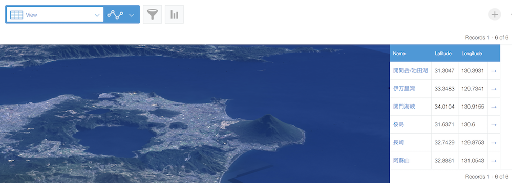
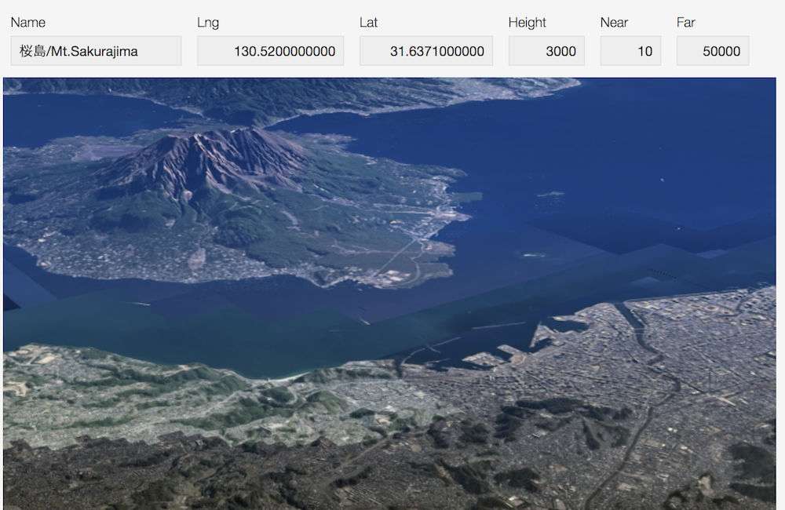
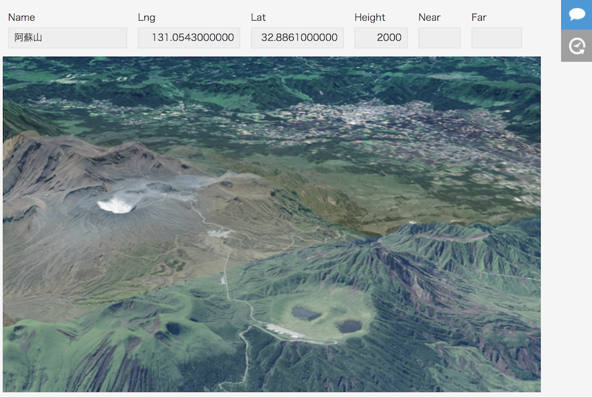

# mapray-sample

## Specification
- Display a map based on information such as latitude and longitude
- Go to detail page from record list
- Change the value on the record edit page, it will be in the map

### Custom view from Mt.Kaimon , Lake Ikeda


|Mt.Sakurajima|Mt.Aso|
|---|---|
|||

## kintone application setting

### Fields

|Field Code|Field Type|Deafault Value|Option|
|---|---|---:|---|
|Name|SINGLE_LINE_TEXT|||
|Lat|NUMBER|130.6|Number of Decimal Places to Display:10|
|Lng|NUMBER|31.6371|Number of Decimal Places to Display:10|
|Height|NUMBER|3000||
|Near|NUMBER|30||
|Far|NUMBER|50000||
|mapray-detail|Blank Space|||


### Custom view
HTML Code
```html
<div class="blockleft">
  <div id="mapray-container"></div>
</div>
<div class="blockdata">
  <div id="mapray-data"></div>
</div>
```

### JavaScript and CSS Customization
#### Upload JavaScript for PC
- jQuery ex.https://js.cybozu.com/jquery/3.4.1/jquery.min.js
- kintone-ui-component.min.js [Download](https://github.com/kintone/kintone-ui-component/tree/master/dist)
- maprayJS ex.https://resource.mapray.com/mapray-js/v0.7.0/mapray.js
- sample.js

#### Upload CSS File for PC
- kintone-ui-component.min.css [Download](https://github.com/kintone/kintone-ui-component/tree/master/dist)
- style.css

*Upload JavaScript File for Mobile Devices, Upload CSS File for Mobile Devices is same too.

## License
MIT License

Produce by Maptomo.
https://maptomo.com/mapray-kintone

